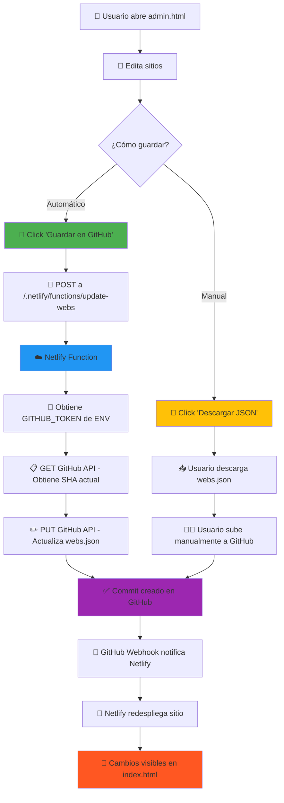

# Flujo de Guardado Automático

## 1️⃣ Frontend (admin.html)

- Usuario edita datos en el formulario
- Datos se guardan en `localStorage`
- Click en "Guardar en GitHub"
- `fetch()` envía datos a la función serverless

## 2️⃣ Backend (Netlify Function)

- Recibe los datos JSON
- Valida estructura y datos
- Obtiene `GITHUB_TOKEN` de variables de entorno
- Llama a GitHub API para obtener SHA actual del archivo
- Actualiza el archivo con nuevo contenido
- Crea commit con mensaje descriptivo

## 3️⃣ GitHub

- Recibe el commit
- Actualiza `data/webs.json`
- Dispara webhook a Netlify

## 4️⃣ Netlify Deploy

- Detecta cambio en repositorio
- Ejecuta build automático
- Despliega nueva versión
- Cambios visibles en producción

## 🔄 Tiempo Total

**~1-2 minutos** desde el click hasta ver los cambios en producción

## 🛡️ Seguridad en Cada Paso

| Paso       | Medida de Seguridad                |
| ---------- | ---------------------------------- |
| Frontend   | No almacena ni conoce el token     |
| Función    | Token solo en variables de entorno |
| GitHub API | Requiere autenticación válida      |
| Netlify    | Variables encriptadas y protegidas |

## 🆚 Comparación de Métodos

### Automático (GitHub API)

✅ Sin pasos manuales
✅ Actualización en 1-2 minutos
✅ Historial automático en Git
✅ Requiere configuración inicial (una sola vez)

### Manual (Descarga JSON)

✅ No requiere configuración
✅ Funciona inmediatamente
❌ Requiere varios pasos
❌ Más propenso a errores humanos
❌ Más lento

## 📊 Estadísticas de Uso

```
Guardado Automático:
  1 click → Actualización completa

Guardado Manual:
  1. Click descargar
  2. Ir a GitHub
  3. Navegar a data/webs.json
  4. Click editar
  5. Copiar/pegar contenido
  6. Commit
  = 6 pasos manuales
```
